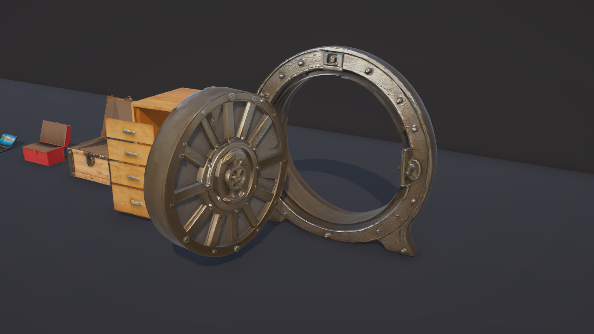

# GOLEM

**Every AI-generated 3D asset is a statue. GOLEM makes it move.**

Text-to-3D can give you a treasure chest in two minutes, but the lid is welded shut: one solid mesh, no parts, no pivots, no mass. In a game that's scenery, not a prop. GOLEM turns that statue into a mechanically interactive, physics-ready game entity. Lids swing on their real hinge line, doors open, drawers slide, and every part carries a mass computed from its own geometry. The same 30 kg ball that tips a 17 kg toolbox onto its side moves a 59 kg filing cabinet 4 cm.

**Hyper3D generates it in about 2 minutes. GOLEM makes it interactive in under 5 seconds, on a laptop.**


*Five Hyper3D Rodin props in Unity after one key press (O): a laptop, a toolbox, a chest, a four-drawer filing cabinet and a 4.5 t vault door. Before GOLEM, every one of them was a single static mesh ([closed](docs/stage_closed.png)).*

Built for the Cambridge × Arcade AI Hackathon, Game Tech track (Tencent Cloud × Hyper3D), 3–4 October 2026.

<!-- TODO before submitting: demo video link and repository link -->
**Demo video:** _link_ · **Repository:** _link_

---

## What GOLEM does

- **Real joints, not animations.** Hinges (revolute) and sliders (prismatic) become Unity `ArticulationBody` joints with limits, driven by motors and simulated by PhysX. Drag any part with the mouse and it follows its own path: lids up, doors around, drawers out.
- **Geometry does the maths.** Pivots, hinge axes, joint limits, colliders and masses are computed from the mesh. Nobody places a pivot by hand.
- **Mass from real mesh volume.** Each part weighs its enclosed mesh volume times an effective density for its material, at real-world scale. The chest lid is 15.7 kg; the vault door is 2.8 t. That is why the same 30 kg ball tips the toolbox onto its side and only nudges the cabinet.
- **Artist-in-the-Loop.** A person makes the creative calls in a few words ("these parts are the door, hinged on the left, opening toward the front") and GOLEM does the rest. These are discrete choices, so a vision model can make them later without changing anything downstream.
- **Engine-agnostic output.** Each prop is a standard glTF 2.0 `.glb` (one node per part; a hinged part's origin sits on its pivot) plus a JSON joint manifest. The Unity importer ships with this repo; any engine with hinge and slider joints can consume the same pair.
- **Measured, not claimed.** A headless self-test drives every joint and checks its direction and travel, and a play-mode audit records how far each prop tilts and slides. Every number on this page comes from those tools.

## Speed and cost

Measured on a laptop (i5-11320H, 24 GB RAM), from [`METRICS.md`](METRICS.md):

| Prop | Hyper3D cloud (generate + BANG) | GOLEM split | GOLEM Unity (import + joints) | **GOLEM total** | End to end | Credits |
|---|---|---|---|---|---|---|
| Chest | 111 s | 3.9 s | 0.72 s | **4.6 s** | 116 s | 0.5 |
| Toolbox | 87 s | 3.8 s | 0.54 s | **4.4 s** | 91 s | 0.5 |
| Laptop | 125 s | 4.2 s | 0.55 s | **4.8 s** | 130 s | 0.5 |
| Vault door | 217 s + 311 s | 3.6 s | 0.69 s | **4.2 s** | 532 s | 1.0 |
| Filing cabinet | 85 s + 283 s | 3.6 s | 0.65 s | **4.3 s** | 372 s | 1.0 |

- **GOLEM's own work: 4.2–4.8 s per prop**, of which 2.0 s is Blender starting up (a batch run pays that once).
- **Hyper3D: 85–125 s per Rodin generation, 283–311 s per BANG split, 0.5 credits per job** (measured from the wallet), through Hyper3D's official CLI.
- Unity imports were timed fresh (cached models deleted first), as for a newly generated asset. Cloud times come from each job's own record and include queueing and download.

## The props

| Prop | Hyper3D | How GOLEM split it | Joints | Real size | Mass: body + moving parts |
|---|---|---|---|---|---|
| Laptop | Rodin Gen-2.5 (came out open, though prompted closed) | Cutter, `--open-part`: the screen stands at 107° | 1 hinge, −105° to +28° | 0.36 m | 3.0 + 0.9 kg |
| Toolbox | Rodin Gen-2.5 | Cutter: seam found automatically at the lid rim | 1 hinge, 0–110° | 0.55 m | 11.9 + 5.0 kg |
| Chest | Rodin Gen-2.5 | Cutter: seam found automatically in the groove | 1 hinge, 0–110° | 0.90 m | 30.0 + 15.7 kg |
| Filing cabinet | Rodin Gen-2.5 + BANG (9 parts) | Assembler: artist names body and fronts; the fourth front is carved out of the carcass | 4 sliders, 0–0.49 m | 1.30 m | 56.5 + 4 drawers of 0.4–1.0 kg |
| Vault door | Rodin Gen-2.5 High + BANG | Assembler: frame, door, hinge on the left, opens toward the front | 1 hinge, 0–100° | 2.20 m | 1,718 + 2,811 kg (frame anchored) |


## How it works

```
 text prompt
     │  Hyper3D Rodin Gen-2.5 (official CLI, 0.5 credits, ~2 min)
     ▼
 one solid .glb ──► Hyper3D BANG (optional: multi-part assets, 0.5 credits, ~5 min)
     │
     ▼  SPLIT: local, headless Blender, ~2 s of work (+2 s Blender start-up)
 ┌──────────────────────────────┬──────────────────────────────────────────────┐
 │ golem_cutter.py              │ golem_assemble.py                            │
 │ boxy lids, laptop screens:   │ multi-part models (BANG):                    │
 │ finds the seam from exact    │ the artist names the root, the moving parts, │
 │ cross-section areas, cuts,   │ the hinge side and the direction; GOLEM      │
 │ caps, puts the hinge on the  │ computes pivots, axes and travel; --carve    │
 │ seam outline                 │ separates parts BANG left fused              │
 └──────────────────────────────┴──────────────────────────────────────────────┘
     ▼
 <name>_split.glb  +  <name>_joints.json        ◄── engine-agnostic hand-off
     │
     ▼  UNITY: ~0.6 s per prop
 glTFast import → real-world scale → ArticulationBody chain: anchors on the pivots,
 limits, drives, convex colliders, mass = volume × density, flat footprint
     ▼
 self-test (every joint driven and checked) → demo stage → Play
```

### Design principle: the model chooses, the geometry computes

AI models (and artists) make **discrete** choices: which part moves, which part it hangs from, hinge or slider, which side the hinge is on, which way it opens. **Continuous** values are never guessed; geometry computes them: the pivot point, the axis, the limits, the mass. A wrong discrete choice is obvious and easy to fix. A guessed pivot is subtly wrong forever.

### Artist-in-the-Loop

This is the vault door, from a single BANG output:

```bash
python golem_assemble.py assets/raw/vault_door_bang.glb --root root.5 \
    --move "door=root.12,root.1,root.2:left:front:100" --name vault_door
```

"The frame is `root.5`; the door is these three parts, hinged on the left, opening toward the front, up to 100°." GOLEM puts the pivot on the door's left edge at the front face, aligns the axis, and writes the joint. The boxy props need even less:

```bash
python golem_cutter.py assets/raw/chest.glb                 # seam, cut and hinge found automatically
python golem_cutter.py assets/raw/laptop.glb --open-part    # parts that were generated already open
```

When BANG leaves a part fused into another, the artist can carve it out: a box in the model's frame, taking only the loose pieces that lie wholly inside it, so nothing is torn. That is how the cabinet got its fourth drawer. The exact command for every prop is in [`golem_props.json`](golem_props.json).

### The joint manifest

The hand-off between GOLEM and any engine is a `.glb` plus this JSON (the vault door, shortened):

```json
{
  "asset": "vault_door",
  "frame": "glTF (right-handed, +Y up, front +Z)",
  "parts": [
    { "node": "body", "role": "root",   "from": ["root.5"] },
    { "node": "door", "role": "moving", "from": ["root.12", "root.1", "root.2"] }
  ],
  "joints": [{
    "type": "revolute", "parent": "body", "child": "door",
    "pivot": [-0.738406, -0.055516, 0.262749],
    "axis": [0.0, -1.0, 0.0],
    "limits_deg": [0.0, 100.0], "rest_deg": 0.0,
    "hinge_side": "left", "opens_toward": "front", "outward": [-1.0, 0.0, 0.0]
  }]
}
```

Everything is in the glTF frame, so it means the same thing in any engine. The Unity importer (`GolemArticulator.cs`, about 200 lines) handles the one subtle step, glTF's right-handed frame to Unity's left-handed one. Points mirror X; rotation axes are pseudo-vectors and map as (x, −y, −z), otherwise every hinge opens backwards. The self-test exists to catch exactly that.

### Physics that holds up

Interactive props are only useful if they don't fall over when you use them. The first stage build failed that test, so we measured and fixed each cause. Open-then-close on the demo stage, with free-standing props:

| Prop | Max tilt before | Max tilt after |
|---|---|---|
| Vault door | 125° (fell flat) | 0.00° |
| Chest | 89° (fell on its back) | 0.25° |
| Toolbox | 11.3° | 0.34° |
| Laptop | 9.6° | 0.11° |
| Filing cabinet | 2.7° | 0.00° |

- **Parts move at a speed their mass allows.** Opening and closing follow a smooth speed profile whose top speed falls with 1/√mass: a 0.9 kg laptop screen swings shut in 1.2 s, the 2.8 t vault door takes 4.0 s. Before, every part covered 90% of its travel in a quarter of a second whatever it weighed, and the motor's kick threw the props over.
- **Inertia-scaled drives.** Every joint drive is critically damped at 10 Hz, scaled by that joint's own inertia, so a 0.9 kg screen and a 2.8 t door track their targets equally well.
- **Flat footprints.** Generated bases are not flat (the chest's varies by 2 cm), so a prop resting on its convex hull rocked from facet to facet as its weight shifted. Each body now stands on a flat footprint at its lowest point.
- **Fixtures are anchored.** The vault's 2.8 t door outweighs its 1.7 t frame; like a real vault door, it is set in place.
- **Dragging never reverses.** The mouse-to-joint mapping is fixed when you grab a part. Tested with 37 scripted drags from four camera angles: every one moved the right way, with no reversals.



## Hyper3D

Every prop's geometry and textures come from **Hyper3D Rodin Gen-2.5**; **Hyper3D BANG** split the two complex ones into parts. Hyper3D's REST keys need the Business tier, so `hyper3d_client.py` drives Hyper3D's official CLI (`@hyper3d/cli` 0.2.0, browser sign-in). It records every billable job in `assets/raw/<name>.job.json` the moment the CLI accepts it, so an interrupted run resumes without paying twice.

| Job | Prompt or instruction |
|---|---|
| Rodin: chest | wooden treasure chest with a hinged lid, closed, boxy shape, metal corner brackets, game prop |
| Rodin: toolbox | metal mechanic's toolbox with a hinged lid, closed, red paint, boxy shape, game prop |
| Rodin: laptop | clamshell laptop, closed, lid shut, game prop |
| Rodin: laptop (retry, unused) | a closed laptop computer, lid shut flat on the keyboard, thin rectangular slab, top view, game prop |
| Rodin: filing cabinet | wooden filing cabinet with three drawers, game prop |
| BANG: filing cabinet | separate the three drawers |
| Rodin High: vault door | A heavy steampunk bank vault door with a central locking wheel. |
| BANG: vault door | separate the vault door and the locking wheel |

8 jobs, 4.0 credits in total.

## Run it

**You need:** Windows 11 (tested), Python 3.14, Blender 5.2 LTS, Unity 6.6 (`6000.6.0f1`). Node.js and `npm i -g @hyper3d/cli` are only needed to generate new models. Unity resolves its packages from the manifest (glTFast 6.20.0, URP 17.6.0, Input System 1.20.0).

```bash
python -m venv .venv && .venv/Scripts/pip install -r requirements.txt
.venv/Scripts/python -m unittest          # cutter tests
```

**1. Get models.** The generated models (166 MB) are not in git.
<!-- TODO: attach assets/raw + assets/split as a release archive and link it here -->
- Download the asset pack (_link_) and unzip it at the repository root, or
- generate your own: `hyper3d auth login`, then for example
  `python hyper3d_client.py generate "wooden treasure chest with a hinged lid, closed" --name chest`
  (and `python hyper3d_client.py bang <name> --instruction "..."` for multi-part models).

**2. Split** (skip this if the asset pack already holds `assets/split/`): run each prop's command from [`golem_props.json`](golem_props.json), for example `python golem_cutter.py assets/raw/chest.glb`. Set `GOLEM_BLENDER` if Blender isn't at its default path.

**3. Unity.** Open `GolemUnity/` in Unity 6.6. In the menu bar: **GOLEM → Import Split Props**, then **GOLEM → Build Demo Stage**, then press **Play**. Headless import and self-test, exiting 0 on pass:
`Unity.exe -batchmode -projectPath GolemUnity -executeMethod Golem.EditorTools.GolemMenu.BuildFromCommandLine`

**Controls (Play mode)**

| Input | Action |
|---|---|
| Left mouse drag on a part | Move it along its joint |
| O / C | Open / close every part |
| 0 | Wide shot |
| 1 – 5 | Close-up: laptop, toolbox, chest, filing cabinet, vault door |
| T / V / B | Roll the 30 kg ball at the toolbox / vault door / filing cabinet (the toolbox shot fires by itself 1.5 s after Play) |

**Re-measure:** `python golem_metrics.py` with the Unity project open regenerates `METRICS.md`. **GOLEM → Run Hinge Self-Test** checks every joint.

## Limits, honestly

- **Part roles are chosen by a person.** Artist-in-the-Loop is the shipped path. The vision-model step is designed (choices are discrete on purpose) but not wired up: Tencent Cloud inference (TokenHub) was blocked behind account verification throughout the build, so the planned Tencent tiers (HY-3D-Component and Hunyuan3D-Part segmentation) are roadmap, not code.
- **Generation and BANG follow instructions only partly.** The cabinet came out with four drawer fronts although the prompt and the BANG instruction both said three, and BANG separated only three of them; asked to separate the vault's locking wheel, BANG left it fused to the door, so the wheel doesn't spin. `--carve` recovers fused parts like the fourth drawer front.
- **Generated meshes are solid.** Drawers are fronts without boxes, cut lids are capped, and masses use per-prop effective densities ([`golem_sizes.json`](golem_sizes.json)) to stand in for hollow real objects.
- **The cutter does horizontal lids only.** Everything else goes through BANG and the assembler.
- **Dragging uses a straight-line mapping.** The grabbed point ends 0–23 px from the cursor, but the big vault door trails it by up to 76 px (in an 846 px view) because its arc is curved.
- **One importer.** Unity is the only engine with an importer today.

## Compliance and AI disclosure

- This repository started at the hackathon. The first commit (`9fadd3b`) is timestamped 16:06:26 IST on 3 October 2026, after hacking began at 15:30 IST. All code here was written during the event.
- Before the event, the author wrote design notes and a separate research prototype (29 September 2026: an oriented-box hinge-candidate solver and a pivot refiner). That prototype lives in another repository; none of its code is used here.
- **AI tools:** the code was written by Claude Code (Anthropic's Claude Opus 5.5) under the author's direction. The 3D models were generated by Hyper3D Rodin Gen-2.5 and split by Hyper3D BANG.
<!-- TODO: add any other AI tools used (for example chat assistants used for planning) -->
