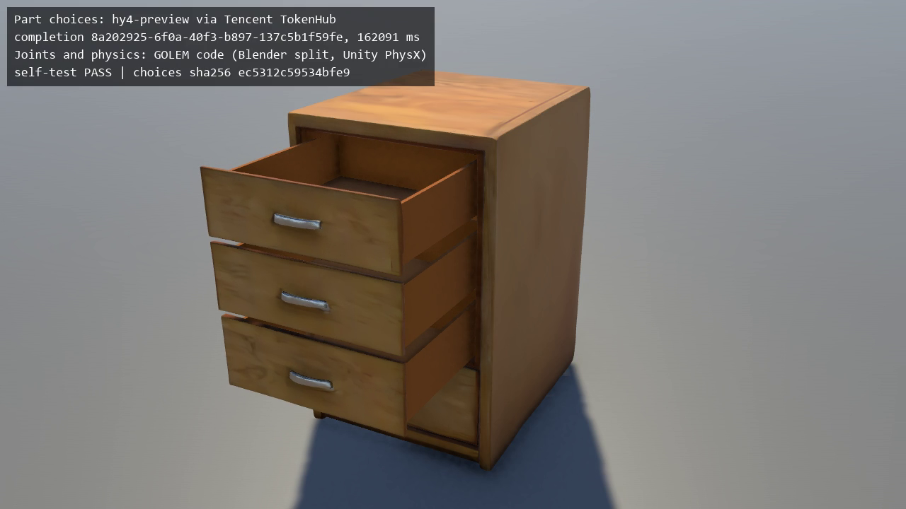
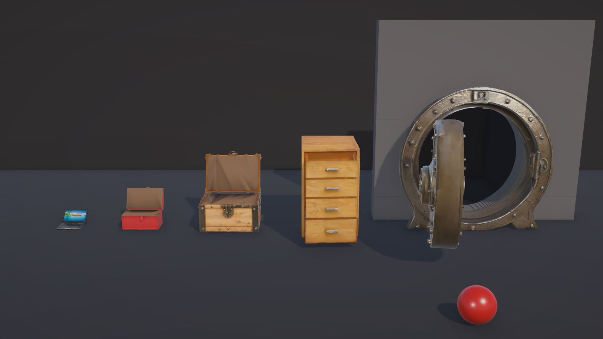
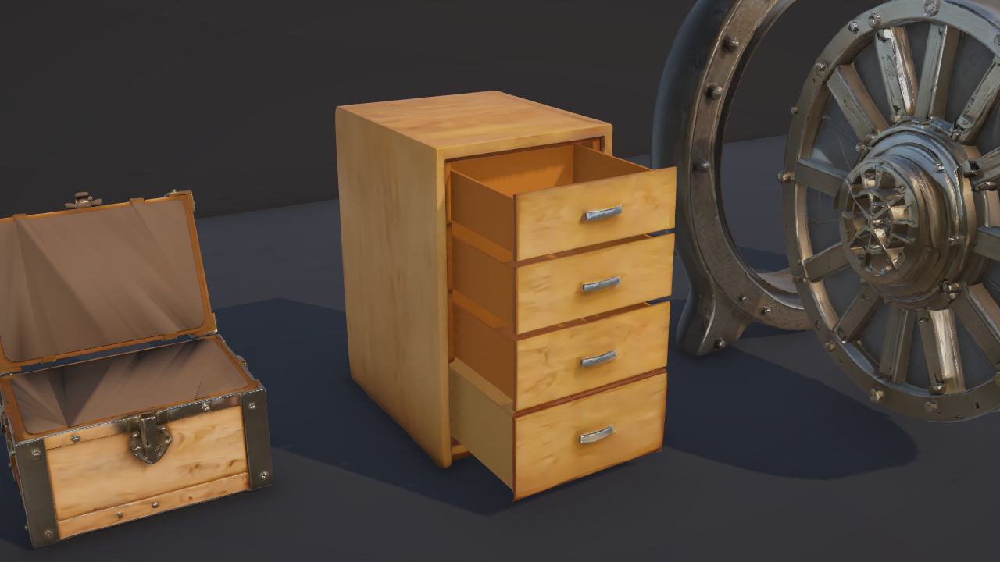

# GOLEM × Tencent Hunyuan

**Every AI-generated 3D asset is a statue. GOLEM makes it move, and Tencent's `hy4-preview` now makes the part calls.**

GOLEM turns a single static mesh from a text-to-3D model into a physics-ready game prop: lids swing on their real hinge line, doors open, drawers slide, and every part carries a mass computed from its own geometry. It won **1st place in the Game Tech track** of the Cambridge × Arcade AI Hackathon (3–4 October 2026). At the hackathon a person made the few discrete calls GOLEM needs ("these parts are the drawers; they slide toward the front"). In this repository **Tencent Hunyuan `hy4-preview`, called through Tencent TokenHub, makes those calls**, and GOLEM's deterministic code does everything numeric and checks the result.



*Frame from [`filing_cabinet_hy4-preview.mp4`](tencent/demo/filing_cabinet_20261006T211801Z/filing_cabinet_hy4-preview.mp4): hy4-preview chose which of the cabinet's 9 parts move and how; GOLEM computed the joints and Unity's PhysX moved them. Rendered with no Editor window by `run_demo.py`; the caption carries TokenHub's completion id for that call.*

**Hackathon build:** [repository](https://github.com/suryaprasanthcse/Golem_Arcade_Game_tech) · [play in the browser](https://suryaprasanthcse.github.io/Golem_Arcade_Game_tech/) · [models (`assets_release.zip`)](https://github.com/suryaprasanthcse/Golem_Arcade_Game_tech/releases/tag/v1.0-hackathon). That repository is unchanged since judging; this one continues from its last commit.

---

## The model chooses, the code guarantees

GOLEM is a neuro-symbolic pipeline. The neural model makes **symbolic** choices from a closed vocabulary; it never outputs a number. Deterministic code turns those choices into geometry and physics, and refuses any answer that doesn't hold together.

| Decision | Made by |
|---|---|
| Which mesh parts are the fixed body and which move | **hy4-preview** |
| Which parts move together as one drawer, door or lid | **hy4-preview** |
| Joint type (hinge or slide) and its side words (`left`, `front`, ...) | **hy4-preview** |
| The part list the model reads: each part's box and the parts it touches | code (`golem_choose.py`: trimesh, KD-tree) |
| Whether the answer is accepted or refused | code (`golem_choose.py`) |
| Pivot points, axes, travel limits, drawer boxes | code (`golem_assemble.py`, in Blender) |
| Real-world scale, masses (mesh volume × density), colliders, joint drives | code (Unity C#: `GolemMenu.cs`, `GolemArticulator.cs`) |
| Pass or fail | code (Unity self-test: every joint driven by PhysX and checked) |
| The mesh itself | Hyper3D Rodin Gen-2.5 and BANG |

```
 multi-part .glb (Hyper3D Rodin + BANG)
     │
     ▼  golem_choose.py (local, ~1 s)
 part list: each part's box as shares of the model, and the parts its surface touches
     │
     ▼  Tencent TokenHub, /v1/chat/completions, model hy4-preview (110–162 s)
 answer: {"parts": {"root.4": "drawer_top", ...}, "joints": {"drawer_top": {"type": "slide", "direction": "front"}}}
     │
     ▼  checks (code): JSON only; every part exactly once; roles, joint types and sides from fixed lists;
     │  no numbers; hinge and opening on different axes; each moving group's parts touch one another
     │  and touch the body. Any failure → the artist's choices file is used instead, and the reason is logged
     ▼
 choices.json ──► golem_auto.py ──► golem_assemble.py (Blender, ~4 s): pivots, axes, limits
     │
     ▼  Unity 6.6, batch mode (~27 s with start-up): import, ArticulationBody joints, masses,
     │  frames of every part moving, hinge self-test
     ▼
 MP4 (FFmpeg) + proof.json: SHA-256 of every file in the chain and TokenHub's ids for the call
```

### The contact list

A text model only knows what the part list tells it. Given boxes alone, hy4-preview paired each drawer front with a thin panel at the back of the cabinet at the same height, which is a reasonable reading of the boxes but not how the cabinet works. So the part list now says which parts physically touch: every part's vertices plus 20,000 surface samples (fixed seed), a nearest-neighbour search with a KD-tree, and two parts touch when at least 1% of either part's samples lie within 0.5% of the model's diagonal of the other. Bounding boxes are only a pre-filter, because every part's box sits inside the shell's box. On the cabinet, the drawer fronts touch only the shell and the back panels touch only the shell and each other, so a front and a back panel can no longer form one drawer: the prompt says so, and the code refuses an answer that tries.

## Measured results

The filing cabinet: 9 mesh parts from Hyper3D BANG, scored against the artist's choices from the hackathon ([`tencent/artist_choices/filing_cabinet.json`](tencent/artist_choices/filing_cabinet.json)).

| Run | Part list | hy4-preview latency | Tokens in / out (reasoning) | Parts: fixed or moving | Drawers grouped exactly | Slide directions | Outcome |
|---|---|---|---|---|---|---|---|
| 7 Oct, ~01:30 IST | boxes only | 160.6 s | 766 / 14,248 (14,064) | 6 of 9 | 0 of 3 | front ×3 | accepted then; **refused** by today's contact check |
| 7 Oct, ~01:53 IST | boxes + contacts | 148.7 s | 944 / 10,043 (9,844) | **9 of 9** | **3 of 3** | **3 of 3** | accepted |
| 7 Oct, 02:42 IST | boxes + contacts | 109.9 s | 944 / 10,061 (9,857) | **9 of 9** | **3 of 3** | **3 of 3** | accepted, full demo run |
| 7 Oct, 02:45 IST | boxes + contacts | 123.1 s | 944 / 10,858 (10,687) | **9 of 9** | **3 of 3** | **3 of 3** | accepted, full demo run |
| 7 Oct, 02:48 IST | boxes + contacts | 162.1 s | 944 / 13,700 (13,537) | **9 of 9** | **3 of 3** | **3 of 3** | accepted, full demo run |

- **One prop, four runs with contacts, the same answer every time.** That is a consistency result on one prop, not a benchmark.
- **Cost:** about 0.026–0.035 USD per call at TokenHub's list price for hy4-preview (0.834 / 2.501 USD per million tokens in / out, 6 October 2026). Nearly all output tokens are the model's hidden reasoning.
- **Whole demo run:** 2.4–3.3 minutes, of which hy4-preview is 110–162 s, the Blender split 4 s, Unity 26–27 s (including start-up) and FFmpeg 1 s. The choice step is a batch step, done once per prop before the game ships.
- **Unity self-test:** PASS on every run; each drawer slid 0.34 m of the 0.34 m it was driven, the right way.

Run records, with the prompt, the part list, the raw reply and the model's reasoning text, are in [`tencent/runs/`](tencent/runs/) and [`tencent/demo/`](tencent/demo/).

## Proof of each run

Every `run_demo.py` run writes `proof.json` next to its video:

- **TokenHub's ids for the call:** the completion id from the response body and the `X-Request-Id` and `X-Trace-Id` headers from Tencent's gateway (on these runs the request id equals the completion id), plus the time the request was sent (UTC), the model the gateway says served it, the latency and the token usage. These identify the call in Tencent's own logs.
- **SHA-256 of every file in the chain:** the input model, the part list with the reply, the choices, the split model, the joint manifest and the video. The files are tamper-evident: change any of them later and its hash no longer matches. The same choices hash is burned into the video's caption.
- **What it does not prove:** the hashes are written by the machine that ran the pipeline, so they show the files haven't changed since the run, not who ran it. TokenHub's ids are what tie the reply to a call on Tencent's side.
- **Code options are listed separately:** `run_demo.py` adds `drawer_boxes` (GOLEM builds a box behind each drawer front) as a code option, and `proof.json` records it under `code_options_added` so it is never mistaken for a model choice.

`--replay` reruns the chain from a stored reply without calling TokenHub (for a demo without a network); the console, the video caption and `proof.json` then say REPLAY.

## Run it

**You need:** Windows 11 (tested), Python 3.14, Blender 5.2 LTS, Unity 6.6 (`6000.6.0f1`), FFmpeg, and a Tencent TokenHub API key with `hy4-preview` enabled (Singapore region by default).

```bash
python -m venv .venv && .venv/Scripts/pip install -r requirements.txt
.venv/Scripts/python -m unittest tests.test_choose      # the answer checks and the contact list, offline
```

1. **Key.** Put `TENCENT_MAAS_API_KEY=<your key>` in `%USERPROFILE%\.golem\secrets.env` (outside the repository; never commit it). The key is only ever sent to `*.tencentcloudmaas.com` hosts and is never printed.
2. **Models.** Unzip `assets_release.zip` from the [hackathon release](https://github.com/suryaprasanthcse/Golem_Arcade_Game_tech/releases/tag/v1.0-hackathon) at the repository root (it holds `assets/raw/`).
3. **Just the choice step:**
   ```bash
   python golem_choose.py assets/raw/filing_cabinet_bang.glb --name filing_cabinet --out choices.json \
       --fallback tencent/artist_choices/filing_cabinet.json --compare tencent/artist_choices/filing_cabinet.json
   ```
4. **The whole loop, headless:**
   ```bash
   python run_demo.py --glb assets/raw/filing_cabinet_bang.glb --name filing_cabinet
   python run_demo.py --glb assets/raw/filing_cabinet_bang.glb --name filing_cabinet \
       --replay tencent/demo/filing_cabinet_20261006T211801Z/choices.run.json      # no TokenHub call
   ```
   Output goes to `tencent/demo/<name>_<UTC time>/`. Set `GOLEM_UNITY`, `GOLEM_FFMPEG` or `GOLEM_BLENDER` if those tools aren't at their default paths, and `GOLEM_TOKENHUB_BASE` for another TokenHub region. The first Unity run imports the project, which takes a few minutes.

`node tencent/hy3d_probe.mjs check` makes a free call that lists the models your key can reach.

## Limits, honestly

- **One prop so far.** The cabinet is the case a part list can answer. On the vault door all four parts are centred, so the side the door hinges on can't be read from boxes and contacts; that test hasn't been run.
- **Text only.** hy4-preview reads the part list, not the model. No Tencent model on TokenHub reads images: sent a 278 KB render, hy4-preview answered "NO IMAGE" and counted 49 prompt tokens.
- **The checks guarantee the form, not the meaning.** A valid but wrong answer can pass them, which is why every run is scored against the artist's choices and the artist's file stays the fallback.
- **Slow.** 110–162 s per call; fine for a batch step, not for a live tool. `hy3`, Tencent's cheaper model, is not tested yet.
- **Not every part is the model's.** The cabinet's fourth drawer was carved out by hand at the hackathon (the model must not set geometry), so in these runs it stays shut. The drawer boxes are built by code.
- **Tencent's 3D models are not used.** `hy-3d-component` is enabled on the account but untested; the meshes still come from Hyper3D.

---

## The GOLEM pipeline (hackathon build)

Everything below was built during the hackathon and is unchanged here, apart from the notes on what this repository adds.



*Five Hyper3D Rodin props in Unity after one key press (O): a laptop, a toolbox, a chest, a four-drawer filing cabinet and a 4.3 t vault door. Before GOLEM, every one of them was a single static mesh ([closed](docs/stage_closed.png)).*

### What GOLEM does

- **Real joints, not animations.** Hinges (revolute) and sliders (prismatic) become Unity `ArticulationBody` joints with limits, driven by motors and simulated by PhysX. Drag any part with the mouse and it follows its own path: lids up, doors around, drawers out.
- **Geometry does the maths.** Pivots, hinge axes, joint limits, colliders and masses are computed from the mesh. Nobody places a pivot by hand.
- **Mass from real mesh volume.** Each part weighs its enclosed mesh volume times an effective density for its material, at real-world scale. The chest lid is 15.7 kg; the vault door is 2.7 t. The same 30 kg ball that tips a 17 kg toolbox onto its side only shakes a 66 kg filing cabinet: it rocks 0.9° and slides 3.6 cm.
- **Discrete choices, made by a person or a model.** Every call GOLEM needs is a pick from a short list, so the same choices file can be written by an artist or, as in this repository, by hy4-preview.
- **Engine-agnostic output.** Each prop is a standard glTF 2.0 `.glb` (one node per part; a hinged part's origin sits on its pivot) plus a JSON joint manifest. The Unity importer ships with this repo; any engine with hinge and slider joints can consume the same pair.
- **Measured, not claimed.** A headless self-test drives every joint and checks its direction and travel, and a play-mode audit records how far each prop tilts and slides.

### Speed and cost

Measured on a laptop (i5-11320H, 24 GB RAM), from [`METRICS.md`](METRICS.md):

| Prop | Hyper3D cloud (generate + BANG) | GOLEM split | GOLEM Unity (import + joints) | **GOLEM total** | End to end | Credits |
|---|---|---|---|---|---|---|
| Chest | 111 s | 4.3 s | 0.56 s | **4.9 s** | 116 s | 0.5 |
| Toolbox | 87 s | 4.1 s | 0.53 s | **4.6 s** | 92 s | 0.5 |
| Laptop | 125 s | 4.3 s | 0.54 s | **4.8 s** | 130 s | 0.5 |
| Vault door | 217 s + 311 s | 3.4 s | 0.69 s | **4.1 s** | 532 s | 1.0 |
| Filing cabinet | 85 s + 283 s | 4.0 s | 0.64 s | **4.6 s** | 373 s | 1.0 |

- **GOLEM's own work: 4.1–4.9 s per prop**, of which 2.1 s is Blender starting up (a batch run pays that once). The hy4-preview choice step adds 110–162 s per prop.
- **Hyper3D: 85–125 s per Rodin generation, 283–311 s per BANG split, 0.5 credits per job**, through Hyper3D's official CLI.

### The props

| Prop | Hyper3D | How GOLEM split it | Joints | Real size | Mass: body + moving parts |
|---|---|---|---|---|---|
| Laptop | Rodin Gen-2.5 (came out open, though prompted closed) | Cutter, `--open-part`: the screen stands at 107° | 1 hinge, −105° to +28° | 0.36 m | 3.0 + 0.9 kg |
| Toolbox | Rodin Gen-2.5 | Cutter: seam found automatically at the lid rim | 1 hinge, 0–110° | 0.55 m | 11.9 + 5.0 kg |
| Chest | Rodin Gen-2.5 | Cutter: seam found automatically in the groove | 1 hinge, 0–110° | 0.90 m | 30.0 + 15.7 kg |
| Filing cabinet | Rodin Gen-2.5 + BANG (9 parts) | Assembler: artist names body and fronts; the fourth front is carved out of the carcass; drawer boxes are built behind the fronts | 4 sliders, 0–0.49 m | 1.30 m | 56.5 + 4 drawers of 1.5–4.5 kg |
| Vault door | Rodin Gen-2.5 High + BANG | Assembler: frame, door, hinge on the left, opens toward the front, hung from an offset hinge arm | 1 hinge, 0–100° | 2.20 m | 1,618 + 2,695 kg (frame anchored) |



### The splitters

```
 one solid .glb ──► Hyper3D BANG (optional: multi-part assets)
     │
     ▼  SPLIT: local, headless Blender, ~2 s of work (+2 s Blender start-up)
 ┌──────────────────────────────┬──────────────────────────────────────────────┐
 │ golem_cutter.py              │ golem_assemble.py                            │
 │ boxy lids, laptop screens:   │ multi-part models (BANG): the choices name   │
 │ finds the seam from exact    │ the body, the moving parts, the hinge side   │
 │ cross-section areas, cuts,   │ and the direction; GOLEM computes pivots,    │
 │ caps, puts the hinge on the  │ axes and travel; --carve separates parts     │
 │ seam outline                 │ BANG left fused                              │
 └──────────────────────────────┴──────────────────────────────────────────────┘
     ▼
 <name>_split.glb  +  <name>_joints.json        ◄── engine-agnostic hand-off
     ▼  UNITY: glTFast import → real-world scale → ArticulationBody chain: anchors on the pivots,
        limits, drives, convex colliders, mass = volume × density, flat footprint → self-test
```

The artist's version of the vault door, from a single BANG output:

```bash
python golem_assemble.py assets/raw/vault_door_bang.glb --root root.5 \
    --move "door=root.12,root.1,root.2:left:front:100" --hinge-arms --name vault_door
```

"The frame is `root.5`; the door is these three parts, hinged on the left, opening toward the front, up to 100°." GOLEM aligns the axis and writes the joint. The exact command for every prop is in [`golem_props.json`](golem_props.json); `golem_auto.py` runs the same splitters from a choices file, which is what hy4-preview's answer becomes.

### The joint manifest

The hand-off between GOLEM and any engine is a `.glb` plus this JSON (the vault door, shortened):

```json
{
  "asset": "vault_door",
  "frame": "glTF (right-handed, +Y up, front +Z)",
  "parts": [
    { "node": "body", "role": "root",   "from": ["root.5"] },
    { "node": "door", "role": "moving", "from": ["root.12", "root.1", "root.2"] }
  ],
  "joints": [{
    "type": "revolute", "parent": "body", "child": "door",
    "pivot": [-0.949902, -0.055516, 0.309393],
    "axis": [0.0, -1.0, 0.0],
    "limits_deg": [0.0, 100.0], "rest_deg": 0.0,
    "hinge_side": "left", "opens_toward": "front", "outward": [-1.0, 0.0, 0.0]
  }]
}
```

Everything is in the glTF frame, so it means the same thing in any engine. The Unity importer (`GolemArticulator.cs`) handles the one subtle step, glTF's right-handed frame to Unity's left-handed one: points mirror X, and rotation axes are pseudo-vectors that map as (x, −y, −z), otherwise every hinge opens backwards. The self-test exists to catch exactly that.

### Physics that holds up

Open-then-close on the demo stage, with free-standing props:

| Prop | Max tilt before | Max tilt after |
|---|---|---|
| Vault door | 125° (fell flat) | 0.00° |
| Chest | 89° (fell on its back) | 0.25° |
| Toolbox | 11.3° | 0.34° |
| Laptop | 9.6° | 0.11° |
| Filing cabinet | 2.7° | 0.00° |

- **Parts move at a speed their mass allows.** Top speed falls with 1/√mass: a 0.9 kg laptop screen swings shut in 1.2 s, the 2.7 t vault door takes 4.0 s.
- **Inertia-scaled drives.** Every joint drive is critically damped at 10 Hz, scaled by that joint's own inertia.
- **Flat footprints.** Each body stands on a flat footprint at its lowest point, so generated bases don't rock.
- **Fixtures are anchored.** The vault's 2.7 t door outweighs its 1.6 t frame, so the frame is set in a wall.

### Production architecture on Tencent Cloud (a design)

```
 game team / live-ops tools ──► GOLEM job queue
                                     │
        ┌────────────────────────────┼─────────────────────────────┐
        ▼                            ▼                             ▼
 Hyper3D REST API             Tencent Cloud GPU instance    Tencent TokenHub
 Rodin Gen-2.5 + BANG         Hunyuan3D-Part, self-hosted   hy4-preview makes the part
                              (not built)                   choices (BUILT, this repo)
        └───────────────► Tencent Cloud CVM workers ◄──────────────┘
                          headless Blender split jobs, many in parallel
                                     ▼
                          Unity batch-mode self-test (pass/fail gate, BUILT)
                                     ▼
                Tencent Cloud COS + CDN: .glb + joint manifest to game clients
```

**Built:** the TokenHub choice step with its checks and fallback, both splitters running headless, the joint manifest, the Unity importer, the batch-mode self-test and headless filming, and per-run proof files. **Not built:** the queue, the worker pool, storage and delivery, and any Tencent 3D model in the loop (`hy-3d-component` is enabled on TokenHub but untested; Hunyuan3D-Part would need a GPU instance).

### Hyper3D

Every prop's geometry and textures come from **Hyper3D Rodin Gen-2.5**; **Hyper3D BANG** split the two complex ones into parts. `hyper3d_client.py` drives Hyper3D's official CLI and records every billable job in `assets/raw/<name>.job.json` the moment Hyper3D accepts it, so an interrupted run resumes without paying twice. 8 jobs, 4.0 credits in total. Prompts are listed in the [hackathon repository](https://github.com/suryaprasanthcse/Golem_Arcade_Game_tech#hyper3d).

### Unity, by hand

Open `GolemUnity/` in Unity 6.6. In the menu bar: **GOLEM → Import Split Props**, then **GOLEM → Build Demo Stage**, then press **Play**. Drag a part with the left mouse button; O / C open and close everything; 0 is the wide shot and 1–5 the close-ups; B / T / V roll a 30 kg ball at the cabinet, toolbox or vault door.

## Compliance and AI disclosure

- **The hackathon build** is every commit up to `552a1bc` (4 October 2026), written during the event; the first commit (`9fadd3b`) is timestamped 16:06:26 IST on 3 October, after hacking began at 15:30 IST. That code is unchanged in the [hackathon repository](https://github.com/suryaprasanthcse/Golem_Arcade_Game_tech).
- **The Tencent integration** (`golem_choose.py`, `run_demo.py`, `GolemDemo.cs`, `tencent/`) was added after the event, on 6–7 October 2026.
- **AI tools:** all code was written by Claude Code (Anthropic's Claude Opus 5.5) under the author's direction. At run time, Tencent Hunyuan `hy4-preview` makes the part choices. The 3D models were generated by Hyper3D Rodin Gen-2.5 and split by Hyper3D BANG.
